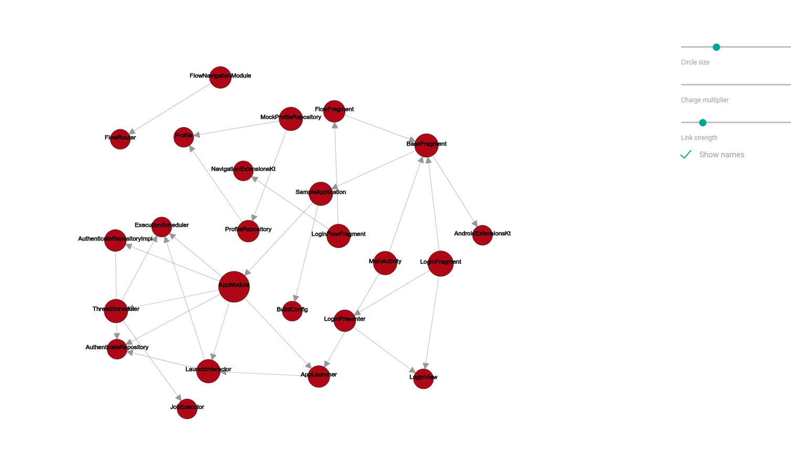

# Apk dependency graph generator

[](https://plugins.gradle.org/plugin/com.acterics.apk-dependency-graph-generator)

Gradle plugin for generating apk dependency graph

## Usage

### Install plugin

In your app `build.gradle`

```groovy
plugins {
  id "com.acterics.apk-dependency-graph-generator" version "0.12.0"
}
```

or

```groovy
buildscript {
  repositories {
    maven {
      url "https://plugins.gradle.org/m2/"
    }
  }
  dependencies {
    classpath "gradle.plugin.com.acterics.apk-dependency-graph-generator:apk-dependency-core-gradle-plugin:0.12.0"
  }
}

apply plugin: "com.acterics.apk-dependency-graph-generator"
```

### Configure plugin

```groovy
ppkDependencyGraphPluginExtension {
    filterPackage = "com.acterics"
    includeInnerClasses = false
    apkPath = "${project.buildDir.absolutePath}/outputs/apk/debug/sample-debug.apk"
}
```

### Build graph

Run

``` bash
./gradlew app:buildGraph
```

Finally open `$buildSrc/apk-dependency-graph/index.html`

## Sample



## Credits

Thanks to [Alex Zaitsev](https://github.com/alexzaitsev) and his [apk-dependency-graph](https://github.com/alexzaitsev/apk-dependency-graph). This project rewrites his library to Kotlin and wrap in gradle plugin.